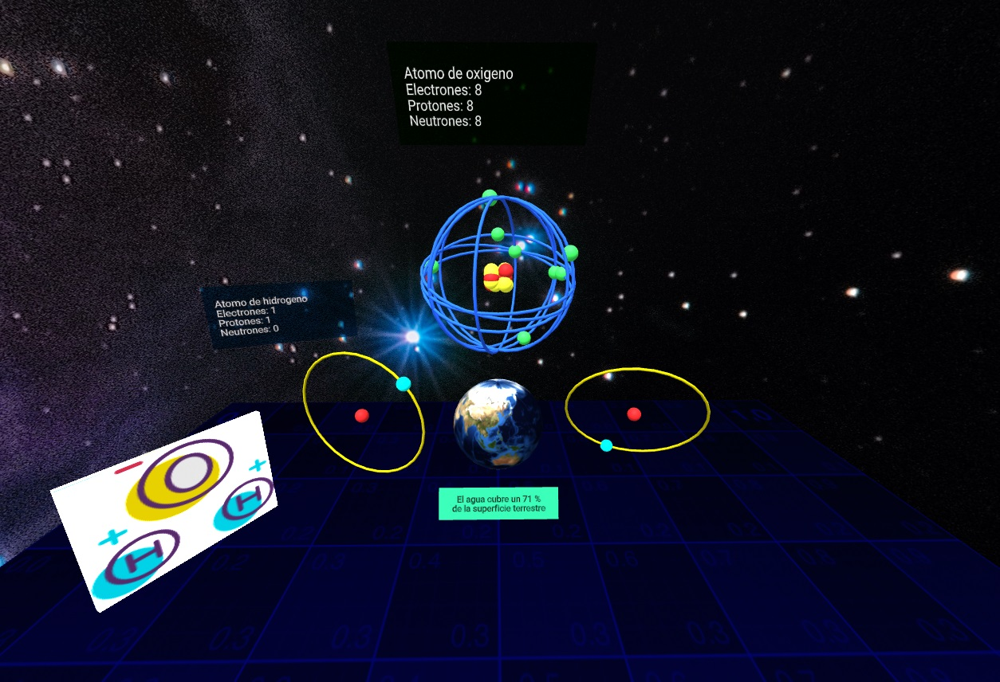

# Web VR

# Requisitos

  - Aframe Inspector (https://github.com/aframevr/aframe-inspector) 
  - Simulador de servidor (Xampp o Wampp)

# Como empezar
  - Iniciar Aframe Inspector
  - Copiar y pegar este proyecto en htdocs ya sea de Xampp o Wampp
  - Acceder desde el navegador con la ruta correspondiente
